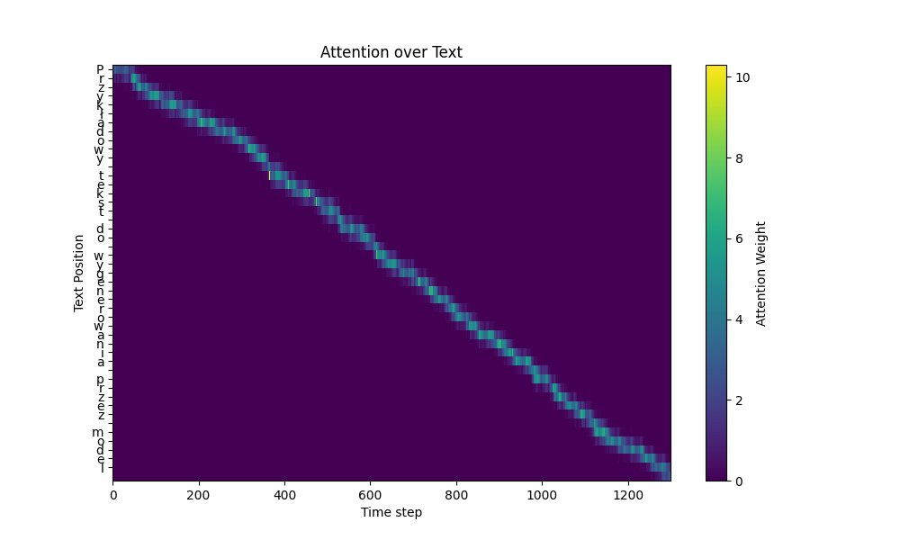
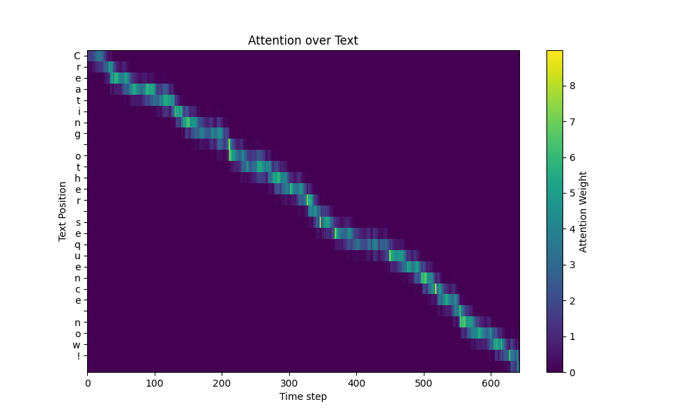

# LSTM HANDWRITING GENERATION

This Project was made, so that it would've been easier for people to get into this kind of topic.
There is **a lot** of other implementation available online, but many of them felt outdated or didnt't meet our expectations. That's why this project was built.

### 1. How does this work?
*  You need to provide some data for learning, in future we plan to make app for creating data public.
* The data is in specific format: each folder in data should contain SVGs, and one txt file matching the content of SVGs in order.
* Then training script is used to start the learning process.
***

### 2. Model structure 
* The model was heavily inspired by Alex Graves and his work:  https://arxiv.org/pdf/1308.0850
* However, we made some significant upgrades:
  - Attention regularization during first epochs to ensure model doesn't skip letters
  - More skip connections to allow for more freedom in gradient flow, so that more sophisticated chars could be learned as well.
  - Enlarging alphabet size for polish chars, anyone can modify charset to their own fit.
  - Allowing for much longer sequences, by exapnding the size, and adding skip connections.
***

### 3. Training process
- We managed to run the training loop on RX 6800 using ROCM on linux, it should work on most modern distros. In case of some problems, refer to AMD tutorials, they should help to pick right solution in your situation.
- Every case should be considered individually, however if someone wants some rough estimations to know if their training is going smoothly, I can offer some tips to you:
	 - **Monitor attention** - this is crucial during first epochs, beacuse offten attention collpase means that there is no way for the model to recover. Attention collpase meaning in this case, that the model tries to generate whole sequence on the span of 20 timesteps, that would suggest that attention module diverged, and the training should be stopped.
	 - The loss should be lowering steadily, (***Wow! That's so instructive***) and what do I mean by that is the fact that picking reasonable learning rate would be important here. The more data you can gather the bigger the learning rate can be. I would recommend learning rates from 5e-4 to 5e-5 depending on situation. 1e-4 is a good place to start.
	 - To get any reasonable results, I would recommend giving the model (if attention is proper) around 5-10 hours to give some signs of learning process going smoothly, and by this I mean that you can recognize individual shapes of letters, but this time might significantly differ depending on your circumstances. Treat this only as some kind of point of reference.
	 - To get model to some decent performance, the training should take at least 24 hours. The exact number is hard to predict, but loss here can give you some direct hints when learning slows down. Ideal loss values are below -5, although down from -3 seems good too. Sometimes even as high as -2 is giving some sensible handwriting.
***

### 4. Examples
Here you can see some examples of generated text in polish and english with their corresponding attention plots during generation.

### 5. What's Next?
* The next would be the repo with app for creating the handwriting. (We should share it in near future)
* If you have any questions, feel free to ask them (If I somehow know the answer, I'll gladly share it with you).
* This repo is still a mess, but I didn't have a lot of time to tidy it up properly.
* Still it might help some of you, who ponder this niche, random AI-topics similarly to me.
***

### Special Thanks
D0d0 for helping and participating in whole project:  
- Managing connection with 3d printer
- Gcode conversion
- App for generating handwriting
- Automation of monitoring the status of learning
- Sacrificing his ***hand, time and sanity*** in order to generate enough data for various experiments.
